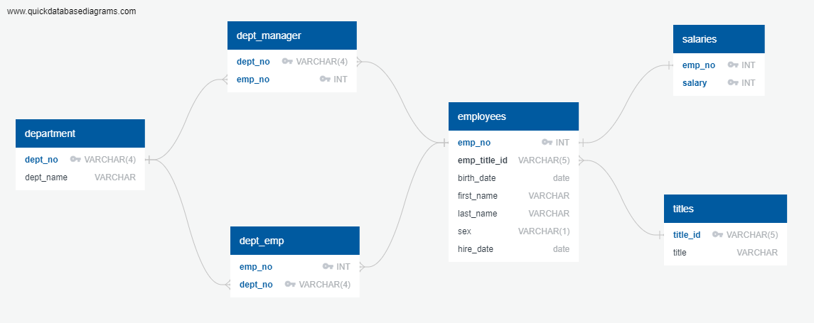
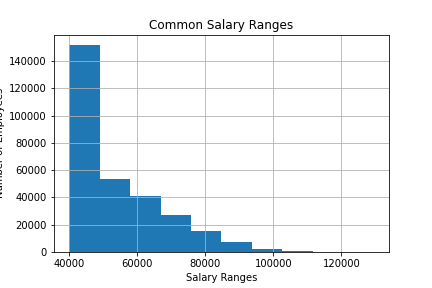
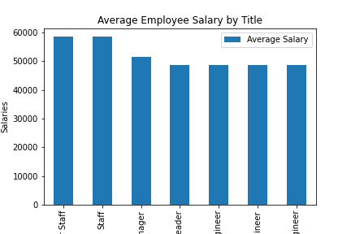

# Employee Database: A Mystery in Two Parts


## Background

This is a research project on employees of a corporation from the 1980s and 1990s. All that remain of the database of employees from that period are six CSV files.

In this Project, I've design the tables to hold data in the CSVs, import the CSVs into a SQL database, and answer some questions about the data.


#### Data Modeling

After inspecting  the CSVs, I've sketched out an ERD of the tables using [http://www.quickdatabasediagrams.com](http://www.quickdatabasediagrams.com).



## Data Engineering

* I've used this table schema to create tables required for each of the six CSV files. To handle foreign keys, the order in trable creation was important:

    ```
    CREATE TABLE "department" (
        "dept_no" VARCHAR(4)   NOT NULL PRIMARY KEY,
        "dept_name" VARCHAR   NOT NULL
    );

    CREATE TABLE "titles" (
        "title_id" VARCHAR(5)   NOT NULL PRIMARY KEY,
        "title" VARCHAR   NOT NULL
    );

    CREATE TABLE "employees" (
        "emp_no" INT   NOT NULL PRIMARY KEY,
        "emp_title_id" VARCHAR(5)   NOT NULL,
        "birth_date" date   NOT NULL,
        "first_name" VARCHAR   NOT NULL,
        "last_name" VARCHAR   NOT NULL,
        "sex" VARCHAR(1)   NOT NULL,
        "hire_date" date   NOT NULL,
        FOREIGN KEY("emp_title_id") REFERENCES "titles" ("title_id")
    );

    CREATE TABLE "dept_emp" (
        "emp_no" INT   NOT NULL,
        "dept_no" VARCHAR(4)   NOT NULL,
        FOREIGN KEY("emp_no") REFERENCES "employees" ("emp_no"),
        FOREIGN KEY("dept_no") REFERENCES "department" ("dept_no"),
        Primary Key ("emp_no","dept_no")
    );

    CREATE TABLE "dept_manager" (
        "dept_no" VARCHAR(4)   NOT NULL,
        "emp_no" INT   NOT NULL,
        FOREIGN KEY("emp_no") REFERENCES "employees" ("emp_no"),
        FOREIGN KEY("dept_no") REFERENCES "department" ("dept_no"),
        Primary Key ("emp_no","dept_no")
    );

    CREATE TABLE "salaries" (
        "emp_no" INT   NOT NULL,
        "salary" INT   NOT NULL,
        FOREIGN KEY("emp_no") REFERENCES "employees" ("emp_no"),
        Primary Key ("emp_no", "salary")
    );


    ```


* Then I imported CSV files into the corresponding SQL tablein the same order that tables were created.

## Data Analysis

Once I got a complete database, Then started answering these question:

1. List the following details of each employee: employee number, last name, first name, sex, and salary.
    ```
    select e.emp_no,e.last_name ,e.first_name, e.sex, s.salary
    from employees as e
    inner join salaries as s
        on s.emp_no = e.emp_no;
    ``` 

2. List first name, last name, and hire date for employees who were hired in 1986.
    ```
    select first_name, last_name, hire_date
    from employees
    where hire_date BETWEEN '01/01/1986' AND '12/31/1986';
    ```

3. List the manager of each department with the following information: department number, department name, the manager's employee number, last name, first name.

    ```
    select dept_manager.dept_no, department.dept_name, dept_manager.emp_no , employees.last_name, employees.first_name
    from dept_manager
    inner join department
	  on dept_manager.dept_no = department.dept_no
	  inner join employees
		on dept_manager.emp_no = employees.emp_no;
    ```

4. List the department of each employee with the following information: employee number, last name, first name, and department name.

    ```
    select employees.emp_no, employees.last_name, employees.first_name, department.dept_name
    from employees 
    inner join dept_emp
	    on employees.emp_no = dept_emp.emp_no
	    inner join department
		    on dept_emp.dept_no = department.dept_no;
    ```

5. List first name, last name, and sex for employees whose first name is "Hercules" and last names begin with "B."

    ```
    select first_name, last_name, sex
    from employees
    where first_name = 'Hercules' and last_name like 'B%';
    ```

6. List all employees in the Sales department, including their employee number, last name, first name, and department name.

    ```
    select e.emp_no,e.last_name,e.first_name, d.dept_name
    from employees as e 
    inner join dept_emp as de
        on e.emp_no = de.emp_no
        inner join department as d
            on de.dept_no = d.dept_no
    where d.dept_name ='Sales';
    ```

7. List all employees in the Sales and Development departments, including their employee number, last name, first name, and department name.

    ```
    select e.emp_no,e.last_name,e.first_name, d.dept_name
    from employees as e 
    inner join dept_emp as de
        on e.emp_no = de.emp_no
        inner join department as d
            on de.dept_no = d.dept_no
    where d.dept_name ='Sales' or d.dept_name ='Development';
    ```

8. In descending order, list the frequency count of employee last names, i.e., how many employees share each last name.

    ```
    select last_name, count(last_name) as "Frequency"
    from employees
    group by last_name
    order by "Frequency" Desc;
    ```

## Bonus - More investigation

As the dataset seemed a bit fake, I decided to take the following steps to generate a visualization of the data. So I imported the SQL database into Pandas. Then I imported Employees, titles ans salaries tables in three dataframes and the merged them to get a combined dataframe. Using this combined dataframe:

* First I created a histogram to visualize the most common salary ranges for employees. It looks strange that most of employees are on lower range




* Then I created a bar chart of average salaries by title. In this graph, interestingly salary for senior engineers, engineers and assistant engineers are all same which is impossible. This one proves that the database is fake.



## Epilogue

At the end I tried to search the combined dataframe for the employee ID number 499942 and retrieve data related to it which confirmed again that the data is fake.
